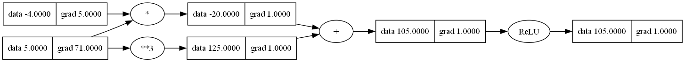

# NanoGrad

NanoGrad is a lightweight autograd engine that implements backpropagation (reverse-mode autodiff) over a dynamically built computation graph. It also includes a small neural networks library with a PyTorch-like API. The neural networks library is built on top of the engine and includes fully connected neural networks with activation functions like ReLU, LeakyReLU, Sigmoid, and tanh.


## 🚀 Features
- **Reverse-mode autodiff:** Dynamically builds a computation graph for backpropagation.
- **Fully connected neural nets:** Simple MLPs with activation functions like ReLU, LeakyReLu, Sigmoid, tanh, etc.
- Ideal for learning how backpropagation and neural networks work under the hood.
- **Visualization:** Graph computation traces using Graphviz for better insight into gradient flow.

## 📦 Installation

1. Install [Graphviz](https://graphviz.org/download/) to visualize the computation graph.
2. Clone the repository to your local machine.
    ```sh
    git clone https://github.com/ShardulJunagade/NanoGrad.git
    cd NanoGrad
    ```
3. Create a virtual environmentand install the required packages.
    ```sh
    python -m venv venv
    venv/bin/activate
    pip install -r requirements.txt
    ```
4. Run [test_engine.py](misc/test_engine.py) for sanity checks.


## Example usage

The following example demonstrates how to construct and differentiate a simple computational graph:

```python
from nanograd.engine import Value

a = Value(-4.0)
b = Value(5.0)
c = a * b + b**3
d = c.relu()

print(f'{d.data:.4f}')        # Forward pass result: 105.0
d.backward()
print(f'dd/da: {a.grad:.4f}') # Gradient w.r.t. a: 5.0
print(f'dd/db: {b.grad:.4f}') # Gradient w.r.t. b: 71.0
```

## 🔍 Tracing & Visualization
To better understand gradient flow, you can visualize the computation graph using `draw_dot()`.

Example code to visualize the computational graph: [test_graphviz.py](misc/test_graphviz.py)
```python
from nanograd.viz import draw_dot

dot = draw_dot(d)
dot.render('misc/computational_graph', format='png', cleanup=True)
```




## 🧠 Training a neural net

NanoGrad comes with a simple MLP implementation, allowing you to train small neural networks from scratch. 
```python
from nanograd import nn
mlp = nn.MLP(2, [8, 8, 1])
```

For a complete example of training an MLP, refer to the [mlp_example.py](misc/mlp_example.py) file.


## Future Work
- **Expand the library:** Add more activation functions, loss functions, optimizers, and regularization techniques.
- **Optimizers:** Add optimizers like Adam, RMSprop, etc.
- **More Layers:** Implement additional neural network layers like Convolutional layers, LSTM, etc.


## 📚 Resources
- [Zero to Hero](https://karpathy.ai/zero-to-hero.html) by Andrej Karpathy


## License

This project is licensed under the MIT License - see the [LICENSE](LICENSE) file for details.
